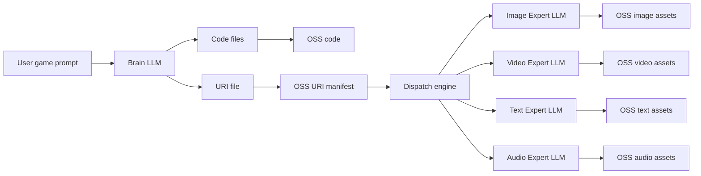
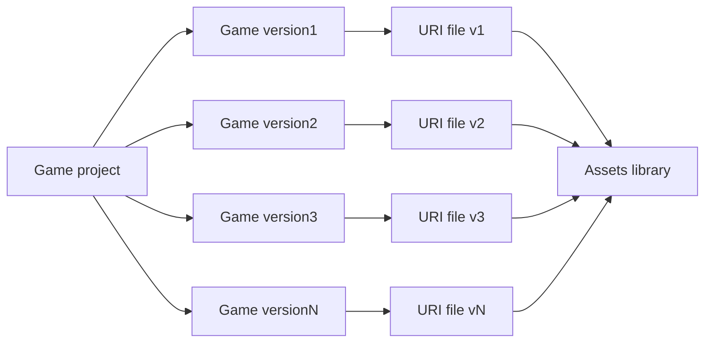

# OminiStudio

Multi-modal AI-powered game development platform built with Next.js and Phaser 3.

[GitHub Repository](https://github.com/jumpingjumpingtiger/oministudio)

OminiStudio leverages different modality LLMs to collaboratively develop H5 games. The master **Brain LLM** generates game logic code and asset requirements; a **Dispatch Engine** routes asset jobs to **Expert LLMs**; generated files are stored under OSS (or local `.data/` in development) and wired into the game via version-scoped **URI files**.

## Demo Video

[](https://youtu.be/YPGmPkAcGko)

**Watch on YouTube:** [https://youtu.be/YPGmPkAcGko](https://youtu.be/YPGmPkAcGko)


## Platform Mission

- **Multi-modal AI game studio** — User describes a game in natural language; the platform outputs a playable **Phaser 3** H5 game with generated code and image assets.
- **Iterative development** — Each prompt creates a new **version** with its own URI file; users switch versions, edit code/assets, and preview without losing history.
- **Engineering pipeline** — Follows the [Core Architecture](#core-architecture): Brain LLM → URI manifest → Dispatch → Expert LLMs → shared asset library.


## Core Architecture

The platform’s core workflow is **Brain LLM → code + URI manifest → Dispatch → Expert LLMs → shared asset library**, with each game version pointing at assets through its own URI file.


### Core Components & Roles

| Component | Role |
|-----------|------|
| **Brain LLM** | Master model that generates game **code files** and the version’s **URI file** (asset manifest). |
| **Expert LLM(s)** | Specialized models that generate assets from prompts in the URI file. Image quality depends on both the expert model and the Brain LLM’s asset prompts. |
| **Dispatch Engine** | Reads the URI file and routes each asset generation task to the appropriate expert LLM (image / video / text / audio). |
| **Asset URI file (`uri.csv`)** | Per-version manifest listing every asset a version needs. Each version has its own URI file; see [Multi-version asset management](#multi-version-asset-management) below. |


### Data Flow




1. User sends a prompt → **Brain LLM** outputs code + URI manifest.
2. Code and URI file are stored (local `.data/` or OSS).
3. **Dispatch engine** reads the URI file and sends each `regenerate: true` asset to the matching expert LLM.
4. Expert outputs are stored in the **project-wide asset library**; the URI file’s `url` column points to each file.

#### Iterative generation context

Each code-generation request is **not** a standalone prompt. Before calling the Brain LLM, the pipeline **retrieves** context by prompt intent (Cursor-style — not a full dump of the project):

| Step | What happens |
|------|----------------|
| **Intent analysis** | Classify prompt: `greenfield`, `code_edit`, `asset_edit`, `bugfix`, `rewrite`, or `iteration` |
| **Relevance scoring** | Rank files, chat messages, and assets by keyword/path overlap with the current prompt |
| **Selective injection** | Include only the most relevant blocks; always keep full **file tree** for orientation |

| Intent | Typical context injected |
|--------|--------------------------|
| `greenfield` | Minimal — no prior chat, assets, or code bodies |
| `code_edit` | Relevant source files + compact asset list + recent chat |
| `asset_edit` | Full asset manifest + preload/scene files + entry points |
| `bugfix` | Recent chat + highest-scoring files + version summary |
| `rewrite` | File tree + recent chat; entry files only (no full codebase) |
| `iteration` | Balanced retrieval across files, chat, and referenced assets |

Context blocks are sourced from SQLite `ChatMessage`, active version `uri.csv` / `pending-assets.json`, and the code directory. Char budgets (~96k total) still apply after retrieval. See `src/lib/engine/brain-context-retrieval.ts` and `src/lib/engine/brain-chat-history.ts`.

**Long conversations (50–100+ turns):** When chat exceeds 20 messages, a tiered strategy applies (Cursor-style pruning):

| Tier | Content |
|------|---------|
| **Recent window** | Last ~12 messages verbatim (more for `bugfix`) |
| **Relevance picks** | Up to 6 older messages matching the current prompt |
| **Compressed summary** | Remaining history as a timeline: `[vN] User: … → Assistant: …` (max ~4k chars) |

The entire chat section is capped at ~14k chars so 100-round histories do not blow the context window.

> **Current status:** Image (`img`) generation is fully implemented. Text, audio, and video expert paths are reserved in the dispatch design but not yet active.

### URI File Format (image example)

Each version stores a CSV at `.data/project/assets/{projectId}/{versionId}/uri.csv`:

| Column | Description |
|--------|-------------|
| `order` | Display / generation order |
| `name` | Logical asset name used in game code |
| `type` | Asset type (`img`, `text`, `audio`, `video`) |
| `uri` | Placeholder in code, e.g. `asset://img/background` — resolved at preview/runtime |
| `url` | Public URL to the binary file in the project asset library |
| `assetId` | Stable ID for the asset record and file on disk |
| `prompt` | Base64-encoded generation prompt for the Expert LLM |
| `regenerate` | `true` = dispatch to Expert LLM; `false` = reuse existing asset from library |
| `format` | Image output format: `png` (sprites with transparency), `jpeg`/`jpg` (backgrounds). Only `png` assets are normalized to real PNG; JPEG/JPG are stored as-is |

Game code references `asset://…` URIs; the play route and preview inject a resolver that maps them to the `url` values from the active version’s URI file.

### Multi-Version Asset Management

Different game versions use **different URI files**, but all versions share one **project-scoped asset library**. The URI file’s `url` column links a version to files in that library — enabling **reuse** (unchanged assets keep `regenerate: false`) while keeping each version’s asset set **isolated** in its own manifest.


- **One library per project** — Binary files live at `.data/project/assets/{projectId}/{type}/{assetId}.{png|jpeg|jpg}` (or OSS in production).
- **One URI file per version** — Defines which library entries this version uses.
- **Immutable updates** — Replacing an asset creates a new `assetId`/file; older versions keep pointing at the previous URL.
- **Reuse** — Brain LLM sets `regenerate: false` for unchanged assets; dispatch skips expert generation and reuses the existing URL


### Local Data Proxy

Game code and assets live under `.data/`, which Next.js does not serve as static files. In development, OminiStudio exposes them through API routes:

| Route | Purpose |
|-------|---------|
| `/api/data/[...path]` | Read any file under `.data/` (path traversal protected) |
| `/api/projects/{id}/play` | Serve `index.html` with `<base href>` pointing at the code directory |

**URL patterns:**

- Code: `/api/data/project/code/{projectId}/{versionId}/{filePath}`
- Assets: `/api/data/project/assets/{projectId}/{type}/{assetId}.{png|jpeg|jpg}`

The play route injects a `<base>` tag so relative script/module paths resolve correctly, and rewrites `asset://` URIs to proxied asset URLs before rendering.

In production, set `ENABLE_LOCAL_DATA_PROXY=true` only if you still use local `.data/` storage; otherwise use OSS URLs directly.


## Features

### Release history

| Date | Summary | Details |
|------|---------|---------|
| **2026-06-26** | **UPG RAG + LangGraph + prompt enhancement** — Replaced naive context injection with UPG/AST hybrid RAG (dense ANN + BM25 + topological diffusion). Split code and assets pipelines into LangGraph nodes with SSE progress. Added pre-RAG `enhance_prompt`, change manifests in chat, Brain code streaming into the Code Editor, cancel/retry, and an English-only UI. | [Release notes](feature/fearture2026-06-26.md) |

### Not Yet Implemented (from original spec)

- Text, audio, and video asset generation (Brain LLM may omit these URIs for now).
- Player save data / per-user game DB (`.data/user/...`).
- Production deployment to OSS / multi-cloud (AWS, GCP, Azure, Aliyun, Volcengine) — local proxy + SQLite are the current dev setup; PostgreSQL mentioned in early spec is not wired in.

### Model Debug

- **Floating draggable panel** — "Model Debug" button (default near top-right); drag to reposition, click to open.
- **Brain / Image / PNG LLM tabs** — Send a test prompt to Brain or Image LLM; upload and convert fake PNGs on the PNG tab.
- **Config display** — Shows configured provider, model, and the env var name for the active API key.

## Getting Started

### Prerequisites

- Node.js 18+
- npm

### Setup

```bash
# Install dependencies
npm install

# Copy environment file and set the minimum variables (see below)
cp .env.example .env

# Initialize database
npm run db:push

# Download local embedding model (for RAG vector retrieval)
npm run embedding:pull

# Start development server
npm run dev
```

Open [http://localhost:3000](http://localhost:3000) in your browser.

### Minimum environment variables

Copy `.env.example` to `.env`, then set the following for **local development** with live LLM generation (run `npm run embedding:pull` before first start):

```env
DATABASE_URL="file:../.data/prisma/dev.db"

BRAIN_LLM_PROVIDER=openai
BRAIN_LLM_MODEL=gpt-4o-mini
BRAIN_OPENAI_API_KEY=sk-...

IMAGE_LLM_PROVIDER=openai
IMAGE_LLM_MODEL=dall-e-3
IMAGE_OPENAI_API_KEY=sk-...

EMBEDDING_PROVIDER=local
EMBEDDING_MODEL=Xenova/paraphrase-multilingual-MiniLM-L12-v2
LOCAL_EMBEDDING_DTYPE=q8
LOCAL_EMBEDDING_CACHE_DIR=.data/models
EMBEDDING_WARMUP=true
HF_HUB_OFFLINE=1
HF_ENDPOINT=https://hf-mirror.com
```

Replace `sk-...` with your OpenAI API keys. Use the **Model Debug** panel to verify provider, model, and key. Other providers — see `.env.example`.

## License

This project is licensed under the [MIT License](LICENSE).

See [CONTRIBUTING.md](CONTRIBUTING.md) for contribution guidelines.
