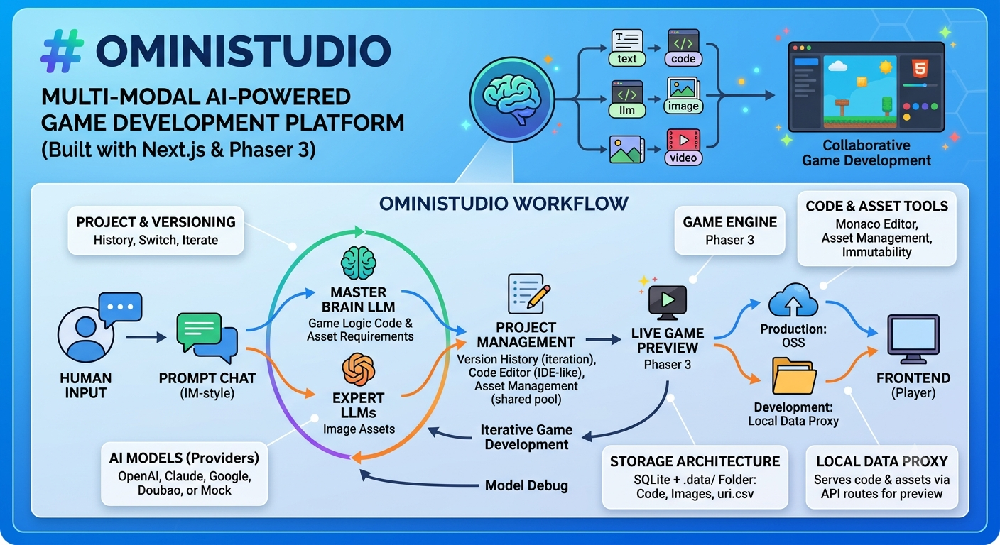

# OminiStudio

Multi-modal AI-powered game development platform built with Next.js and Phaser 3.

OminiStudio leverages different modality LLMs to collaboratively develop H5 games. The master brain LLM generates game logic code and asset requirements, while expert LLMs produce image assets that are injected into the game at runtime.

## Demo Video

[](https://youtu.be/YPGmPkAcGko)

**Watch on YouTube:** [https://youtu.be/YPGmPkAcGko](https://youtu.be/YPGmPkAcGko)

## Workflow



## Features

This section consolidates capabilities delivered across the agent specification iterations (`agent.MD` → `agent.9.MD`), verified against the current codebase.

### Platform Mission

- **Multi-modal AI game studio** — User describes a game in natural language; the platform outputs a playable **Phaser 3** H5 game with generated code and image assets.
- **Iterative development** — Each prompt creates a new **version**; users switch versions, edit code/assets, and preview results without losing history.
- **Engineering pipeline** — A **Brain LLM** produces game logic and asset requirements; a **dispatch engine** routes image jobs to an **Expert Image LLM**; URI placeholders in code are resolved to real URLs at preview/runtime.

### AI & Generation Pipeline

| Capability | Status |
|------------|--------|
| Brain LLM generates code files + asset list + summary | ✅ |
| Expert Image LLM generates `img` assets | ✅ |
| Text / audio / video asset generation | 🔜 Framework reserved; not active |
| **Two-phase SSE generation** — `POST .../generate/code` then `POST .../generate/assets` | ✅ |
| Real-time SSE progress (status, thinking, files, assets, errors) | ✅ |
| **Asset reuse** — Brain LLM sets `regenerate: true/false`; unchanged assets skip image generation | ✅ |
| Brain LLM prompt includes **image dimension guidance** for Phaser sprite sizing | ✅ |
| **Multi-provider LLM** — Brain: OpenAI / Claude / Google / Doubao; Image: OpenAI / Google / Doubao | ✅ |
| Mock/demo mode when API keys are not configured | ✅ |
| `asset://type/name` URI scheme + runtime resolver injected into preview HTML | ✅ |

**SSE event types (generation):** `status`, `thinking`, `version_created`, `files_planned`, `file_planned`, `file_writing`, `file_written` (with content + diff metadata), `code_complete`, `assets_planned`, `asset_generating`, `asset_generated`, `asset_reused`, `asset_failed`, `complete`, `error`

### Projects & Versions

- **Project CRUD** — Create, list, rename, delete projects from the left sidebar.
- **Auto-create on first chat** — If no project exists, the first prompt automatically creates one; the project name is **condensed from the prompt text**.
- **Version history** — Each prompt creates an independent version; users **switch the active version** to iterate or roll back.
- **Collapsible panels** — Version panel (top-left) and Project panel (bottom-left) can be hidden.
- **Version badges** — Assistant chat messages show which version (e.g. `Version v3`) they belong to.

### Chat Panel

- **IM-style layout** — User messages on the right; assistant on the left with a project avatar.
- **Optimistic user message** — Sent prompt appears immediately at the bottom of history (before generation finishes).
- **File attachments** — Users can attach files to prompts (metadata stored with the message).
- **Auto-growing input** — Textarea expands vertically with content (multi-line prompts).
- **Resizable chat area** — Drag handle adjusts chat panel height vs the code/preview area above.
- **Live generation bubble** — While generating, shows thinking status, file/asset queues, and per-step progress from SSE.
- **Message ordering** — User message → generation status → final assistant summary with version info.

### Code Editor

- **IDE-like layout** — File tree (left) + **Monaco Editor** (right).
- **File operations** — Create, edit, delete files; **Save** button and **Cmd/Ctrl+S** both persist to the server (`PUT /api/projects/{id}/code`).
- **Version-scoped reads** — During generation, reads the in-progress version via `versionId`.
- **Real-time incremental file tree (SSE)** — Files appear one-by-one as `file_planned` → `file_writing` → `file_written` events arrive (not all at once after LLM completes).
- **Change markers** — **N** (new) / **M** (modified) badges and color highlights on the tree.
- **Live Diff view** — After each file is written, **Monaco DiffEditor** shows side-by-side old vs new content during generation.
- **Auto-follow** — Editor selection follows the latest written file.

> **Note:** File list/content is pushed per file after the Brain LLM returns. Streaming token-by-token file content from the LLM is not implemented.

### Asset Management

- **Version-scoped asset list** — Shows assets for the **current version** via `uri.csv` (or pending assets during the code-only phase).
- **Tree layout** — Assets grouped by type (`img`); hover shows **URI / URL** tooltip.
- **CRUD operations** — Upload new image, replace file, regenerate from edited prompt, remove from version's `uri.csv`.
- **Immutable assets** — Replace/regenerate creates a new DB record + file; previous assets remain for other versions.
- **Real-time updates (SSE)** — Assets appear as they are planned/generated; spinner on in-progress items; blue indicator for **reused** assets, green for **newly generated**.

### Game Preview

- **Live Phaser 3 preview** — iframe loads `/api/projects/{id}/play` with injected `<base href>`, asset resolver, and centering styles.
- **Version-aware** — Preview follows the active or in-generation version.
- **Live refresh during generation** — Preview panel shows a "Live" indicator and refreshes as code/assets update.
- **Centered layout** — Game canvas centered in the preview frame (no black letterbox bars).
- **Maximize** — Full-screen preview mode with exit control.

### Model Debug

- **Floating draggable panel** — "Model Debug" button (default near top-right); drag to reposition, click to open.
- **Brain / Image tabs** — Send a test prompt to either LLM.
- **Config display** — Shows configured provider, model, and whether API keys are set.

### Layout & Theme

- **Light theme** UI (CSS custom properties).
- **Resizable layout** — Horizontal splitter (sidebar width), vertical splitter (chat height).
- **Right panel tabs** — **Preview** (default) / **Code** / **Assets**.
- **Local data proxy** — Serves `.data/` code and assets via `/api/data/...` in development (or `ENABLE_LOCAL_DATA_PROXY=true`).

### Data & Storage (Implemented)

| Data | Location |
|------|----------|
| Projects, versions, assets, messages | SQLite via Prisma (`.data/prisma/dev.db`) |
| Game code | `.data/project/code/{projectId}/{versionId}/` |
| Image files | `.data/project/assets/{projectId}/{type}/{assetId}.png` |
| Version asset index | `.data/project/assets/{projectId}/{versionId}/uri.csv` |
| Asset URI → URL mapping | Database (`Asset` table) + per-version `uri.csv` |

Shared asset pool: multiple versions can reference the same underlying image file; `uri.csv` per version maps logical URIs to URLs.

### Not Yet Implemented (from original spec)

- Text, audio, and video asset generation (Brain LLM may omit these URIs for now).
- Player save data / per-user game DB (`.data/user/...`).
- Production deployment to OSS / multi-cloud (AWS, GCP, Azure, Aliyun, Volcengine) — local proxy + SQLite are the current dev setup; PostgreSQL mentioned in early spec is not wired in.

## Tech Stack

- **Framework**: Next.js 15 (App Router)
- **Language**: TypeScript
- **Database**: SQLite (local) via Prisma ORM
- **Editor**: Monaco Editor
- **Game Engine**: Phaser 3
- **AI**: OpenAI / Anthropic / Google / Doubao (optional — works with mock data without API keys)

## Getting Started

### Prerequisites

- Node.js 18+
- npm

### Installation

```bash
# Install dependencies
npm install

# Set up environment variables
cp .env.example .env
# Edit .env and add your OPENAI_API_KEY (optional)

# Initialize database
npm run db:push

# Start development server
npm run dev
```

Open [http://localhost:3000](http://localhost:3000) in your browser.

### Environment Variables

| Variable | Description | Default |
|----------|-------------|---------|
| `DATABASE_URL` | SQLite database path | `file:../.data/prisma/dev.db` |
| `BRAIN_LLM_PROVIDER` | Brain LLM provider: `openai`, `claude`, `google`, `doubao` | `openai` |
| `BRAIN_LLM_MODEL` | Brain LLM model name | Provider default |
| `IMAGE_LLM_PROVIDER` | Image LLM provider: `openai`, `google`, `doubao` | `openai` |
| `IMAGE_LLM_MODEL` | Image generation model name | Provider default |
| `OPENAI_API_KEY` | OpenAI API key | — |
| `ANTHROPIC_API_KEY` | Anthropic (Claude) API key | — |
| `GOOGLE_API_KEY` | Google AI API key | — |
| `DOUBAO_API_KEY` | Doubao (Volcengine) API key | — |
| `DOUBAO_BASE_URL` | Doubao OpenAI-compatible base URL | Volcengine default |
| `DOUBAO_IMAGE_SIZE` | Doubao image size (min 2560x1440 for Seedream 4.x+) | `2048x2048` |
| `ENABLE_LOCAL_DATA_PROXY` | Serve `.data/` files via `/api/data/` in non-dev environments | `false` |

#### Provider Model Examples

| Provider | Brain Model Example | Image Model Example |
|----------|--------------------|--------------------|
| OpenAI | `gpt-4o`, `gpt-4o-mini` | `dall-e-3` |
| Claude | `claude-sonnet-4-20250514` | — |
| Google | `gemini-2.0-flash` | `imagen-3.0-generate-002` |
| Doubao | `doubao-pro-32k` | `doubao-seedream-3-0-t2i` |

Without configured API keys, the platform uses mock data to generate a demo platformer game with placeholder assets.

## Asset Architecture

- **Database** — Stores all assets with project-scoped URI and globally unique URL (`/api/data/project/assets/{projectId}/{type}/{assetId}.png`)
- **Version uri.csv** — Each version has `.data/project/assets/{projectId}/{versionId}/uri.csv` mapping URI → URL
- **File storage** — Assets stored at `.data/project/assets/{projectId}/{type}/{assetId}.png`
- **Immutability** — Updating an asset creates a new record; old assets remain for other versions to reference

## Local Data Proxy

Game code and assets live under `.data/`, which Next.js does not serve as static files. In development, OminiStudio exposes them through API routes:

| Route | Purpose |
|-------|---------|
| `/api/data/[...path]` | Read any file under `.data/` (path traversal protected) |
| `/api/projects/{id}/play` | Serve `index.html` with `<base href>` pointing at the code directory |

**URL patterns:**

- Code: `/api/data/project/code/{projectId}/{versionId}/{filePath}`
- Assets: `/api/data/project/assets/{projectId}/{type}/{assetId}.png`

The play route injects a `<base>` tag so relative script/module paths resolve correctly, and rewrites `asset://` URIs to proxied asset URLs before rendering.

In production, set `ENABLE_LOCAL_DATA_PROXY=true` only if you still use local `.data/` storage; otherwise use OSS URLs directly.

## Frontend API Reference

All HTTP calls from the main UI (`page.tsx` and child components). Indirect loads (iframe, ``, game scripts) are listed separately.

### UI → API Map

| UI area | Component | APIs used |
|---------|-----------|-----------|
| Project sidebar | `ProjectPanel` (via `page.tsx`) | `GET/POST /api/projects`, `PATCH/DELETE /api/projects/{id}` |
| Version sidebar | `VersionPanel` (via `page.tsx`) | `GET /api/projects/{id}/versions`, `POST /api/projects/{id}/versions` |
| Chat | `ChatPanel` (via `page.tsx`) | `GET /api/projects/{id}/messages`, `POST .../generate/code`, `POST .../generate/assets` |
| Code editor | `CodeEditorPanel` | `GET/POST/PUT/DELETE /api/projects/{id}/code` |
| Assets panel | `AssetManager` | `GET/POST/PATCH/DELETE /api/projects/{id}/assets` |
| Game preview | `GamePreview` | `GET /api/projects/{id}/preview`, `GET /api/projects/{id}/play` (iframe) |
| Model debug | `ModelDebugPanel` | `GET/POST /api/debug/llm` |

---

### Projects

#### `GET /api/projects`

List all projects (newest first).

**Used by:** `page.tsx` → `fetchProjects`

**Response:** `Project[]` with `_count.versions`, `_count.assets`, and active version.

#### `POST /api/projects`

Create a project.

**Used by:** `page.tsx` → `handleCreateProject` (also auto-called on first chat message)

**Body:**

```json
{ "name": "My Game", "description": "" }
```

**Response:** `201` — created `Project`

#### `PATCH /api/projects/{id}`

Rename a project.

**Used by:** `page.tsx` → `handleRenameProject`

**Body:**

```json
{ "name": "New Name" }
```

#### `DELETE /api/projects/{id}`

Delete a project and its `.data/` directories.

**Used by:** `page.tsx` → `handleDeleteProject`

---

### Versions

#### `GET /api/projects/{id}/versions`

List versions for a project (newest first).

**Used by:** `page.tsx` → `fetchVersions`

#### `POST /api/projects/{id}/versions`

Switch the active version.

**Used by:** `page.tsx` → `handleSwitchVersion`

**Body:**

```json
{ "action": "switch", "versionId": "<version-id>" }
```

---

### Chat Messages

#### `GET /api/projects/{id}/messages`

List chat history (oldest first), including linked version summary.

**Used by:** `page.tsx` → `fetchMessages`

**Response:** `ChatMessage[]` with optional `version: { id, summary }`

> User messages are also persisted by `POST .../generate/code` before generation starts.

---

### Game Generation (SSE)

Generation is split into two phases. The frontend consumes Server-Sent Events from both endpoints.

**SSE format:** `data: {"type":"...", ...}\n\n`

**Event types:** `status`, `thinking`, `version_created`, `files_planned`, `file_planned`, `file_writing`, `file_written`, `code_complete`, `assets_planned`, `asset_generating`, `asset_generated`, `asset_reused`, `asset_failed`, `complete`, `error`

#### `POST /api/projects/{id}/generate/code`

Phase 1 — Brain LLM designs logic, creates a version, writes code files.

**Used by:** `page.tsx` → `handleSendPrompt`

**Body:**

```json
{
  "prompt": "Create a platformer game",
  "files": [{ "name": "ref.png", "type": "image/png", "size": 1234 }]
}
```

**SSE highlights:**

| Event | When |
|-------|------|
| `version_created` | New version row created — frontend sets `generatingVersionId` |
| `file_writing` / `file_written` | Each code file |
| `code_complete` | Code phase done — includes `versionId` for phase 2 |

#### `POST /api/projects/{id}/generate/assets`

Phase 2 — Generate or reuse image assets, resolve URIs in code, write assistant chat message.

**Used by:** `page.tsx` → `handleSendPrompt` (after code phase)

**Body:**

```json
{
  "versionId": "<from code_complete>"
}
```

**SSE highlights:**

| Event | When |
|-------|------|
| `asset_generating` / `asset_generated` / `asset_reused` | Per asset |
| `file_writing` / `file_written` | URI resolution pass over code files |
| `complete` | Full pipeline done |

---

### Code Files

#### `GET /api/projects/{id}/code`

**Used by:** `CodeEditorPanel` → `fetchFiles`, `fetchFileContent`

| Query | Returns |
|-------|---------|
| _(none)_ or `?versionId=` | `{ files: string[], versionId }` — file tree |
| `?path=<file>&versionId=` | `{ path, content, versionId }` — single file |

During generation, pass `versionId={generatingVersionId}` to read the in-progress version.

#### `PUT /api/projects/{id}/code`

Save file content.

**Body:** `{ "path": "main.js", "content": "...", "versionId": "..." }`

#### `POST /api/projects/{id}/code`

Create a new file.

**Body:** `{ "path": "utils.js", "content": "", "versionId": "..." }`

#### `DELETE /api/projects/{id}/code?path=<file>&versionId=`

Delete a file.

---

### Assets

#### `GET /api/projects/{id}/assets`

List assets for a version (from `uri.csv`, or pending assets during code-only phase).

**Used by:** `AssetManager` → `fetchAssets`

**Query:** `?versionId=` (optional; defaults to active version)

**Response:** `{ versionId, assets: VersionAsset[], uriCsv }`

#### `POST /api/projects/{id}/assets`

Upload a new image asset.

**Used by:** `AssetManager` → `handleUpload`

**Body:** `multipart/form-data` — `file`, `name`, optional `versionId`

#### `PATCH /api/projects/{id}/assets`

Replace or regenerate an asset for a URI in the current version.

**Used by:** `AssetManager` → `handleReplaceFile`, `handleRegenerate`

**Body (file replace):** `multipart/form-data` — `file`, `uri`, optional `versionId`

**Body (regenerate):** `{ "uri": "asset://img/player", "prompt": "...", "versionId": "..." }`

#### `DELETE /api/projects/{id}/assets?uri=<uri>&versionId=`

Remove an asset entry from the version's `uri.csv`.

**Used by:** `AssetManager` → `handleDelete`

---

### Game Preview

#### `GET /api/projects/{id}/preview`

Check whether a playable game exists and return resolved file contents.

**Used by:** `GamePreview` → `loadPreview` (before loading iframe)

**Query:** `?versionId=` (optional)

**Response:** `{ versionId, files: Record<path, content>, assets, uriCsv }`

Returns `404` if no version exists. Frontend treats missing `files["index.html"]` as "no game yet".

#### `GET /api/projects/{id}/play`

Serve runnable `index.html` inside the preview iframe.

**Used by:** `GamePreview` — `iframe.src` (not `fetch`)

**Query:** `versionId`, `v` (refresh key), `t` (cache buster)

**Response:** `text/html` with injected `<base href>`, asset resolver script, preview centering styles, and resolved `asset://` URIs.

Requires local data proxy (dev mode or `ENABLE_LOCAL_DATA_PROXY=true`).

---

### Indirect Loads (not called via `fetch`)

These routes are loaded by the game iframe or asset URLs in the UI:

| Route | Loaded by |
|-------|-----------|
| `/api/data/project/code/{projectId}/{versionId}/{file}` | Game scripts/styles via `<base href>` in play route |
| `/api/data/project/assets/{projectId}/{type}/{assetId}.png` | Asset thumbnails in `AssetManager`, game runtime |

---

### LLM Debug

#### `GET /api/debug/llm`

Return configured brain/image LLM providers and whether API keys are set.

**Used by:** `ModelDebugPanel` (on panel open)

#### `POST /api/debug/llm`

Run a one-off brain or image LLM call.

**Used by:** `ModelDebugPanel` → `handleRun`

**Body:**

```json
{ "type": "brain", "prompt": "..." }
```

`type` can be `"brain"` or `"image"`. Image responses include a base64 `preview` data URL.

---

```
src/
├── app/                    # Next.js App Router pages and API routes
│   ├── api/               # REST API endpoints
│   └── page.tsx           # Main application page
├── components/            # React UI components
├── lib/
│   ├── engine/           # Brain LLM, dispatch engine, pipeline
│   ├── db.ts             # Prisma client
│   ├── storage.ts        # File storage utilities
│   └── types.ts          # Shared TypeScript types
prisma/
└── schema.prisma          # Database schema
.data/                     # Local file & database storage (gitignored)
```

## Data Storage

- **Relational data** (projects, versions, assets, messages): SQLite via Prisma
- **Game code**: `.data/project/code/{projectId}/{versionId}/`
- **Image assets**: `.data/project/assets/{projectId}/img/`
- **Asset URI file**: `.data/project/assets/{projectId}/{versionId}/uri.csv`

## License

This project is licensed under the [MIT License](LICENSE).

See [CONTRIBUTING.md](CONTRIBUTING.md) for contribution guidelines.
