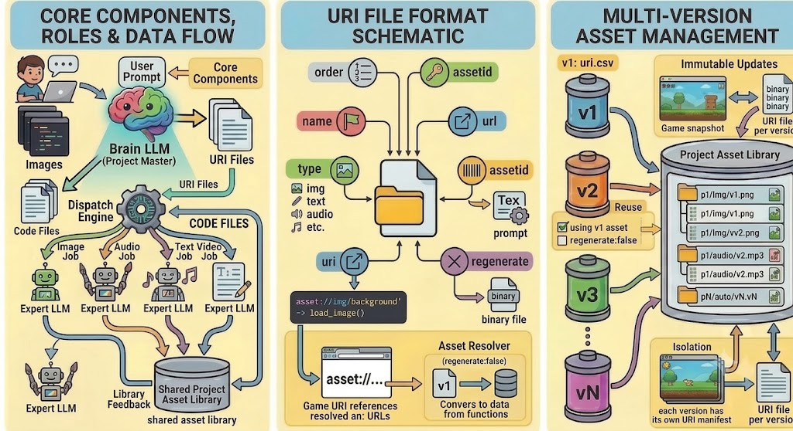
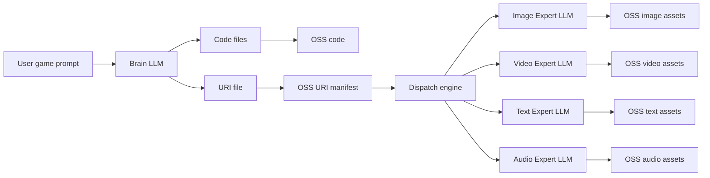
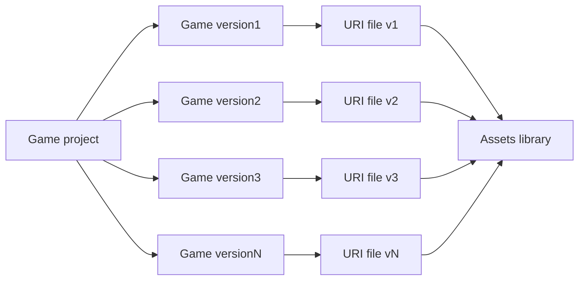

# OminiStudio

Multi-modal AI-powered game development platform built with Next.js and Phaser 3.

[GitHub Repository](https://github.com/jumpingjumpingtiger/oministudio)

OminiStudio leverages different modality LLMs to collaboratively develop H5 games. The master **Brain LLM** generates game logic code and asset requirements; a **Dispatch Engine** routes asset jobs to **Expert LLMs**; generated files are stored under OSS (or local `.data/` in development) and wired into the game via version-scoped **URI files**.

## Demo Video

[](https://youtu.be/YPGmPkAcGko)

**Watch on YouTube:** [https://youtu.be/YPGmPkAcGko](https://youtu.be/YPGmPkAcGko)


## Platform Mission

- **Multi-modal AI game studio** — User describes a game in natural language; the platform outputs a playable **Phaser 3** H5 game with generated code and image assets.
- **Iterative development** — Each prompt creates a new **version** with its own URI file; users switch versions, edit code/assets, and preview without losing history.
- **Engineering pipeline** — Follows the [Core Architecture](#core-architecture): Brain LLM → URI manifest → Dispatch → Expert LLMs → shared asset library.


## Core Architecture

The platform’s core workflow is **Brain LLM → code + URI manifest → Dispatch → Expert LLMs → shared asset library**, with each game version pointing at assets through its own URI file.





### Core Components & Roles

| Component | Role |
|-----------|------|
| **Brain LLM** | Master model that generates game **code files** and the version’s **URI file** (asset manifest). |
| **Expert LLM(s)** | Specialized models that generate assets from prompts in the URI file. Image quality depends on both the expert model and the Brain LLM’s asset prompts. |
| **Dispatch Engine** | Reads the URI file and routes each asset generation task to the appropriate expert LLM (image / video / text / audio). |
| **Asset URI file (`uri.csv`)** | Per-version manifest listing every asset a version needs. Each version has its own URI file; see [Multi-version asset management](#multi-version-asset-management) below. |


### Data Flow




1. User sends a prompt → **Brain LLM** outputs code + URI manifest.
2. Code and URI file are stored (local `.data/` or OSS).
3. **Dispatch engine** reads the URI file and sends each `regenerate: true` asset to the matching expert LLM.
4. Expert outputs are stored in the **project-wide asset library**; the URI file’s `url` column points to each file.

> **Current status:** Image (`img`) generation is fully implemented. Text, audio, and video expert paths are reserved in the dispatch design but not yet active.

### URI File Format (image example)

Each version stores a CSV at `.data/project/assets/{projectId}/{versionId}/uri.csv`:

| Column | Description |
|--------|-------------|
| `order` | Display / generation order |
| `name` | Logical asset name used in game code |
| `type` | Asset type (`img`, `text`, `audio`, `video`) |
| `uri` | Placeholder in code, e.g. `asset://img/background` — resolved at preview/runtime |
| `url` | Public URL to the binary file in the project asset library |
| `assetId` | Stable ID for the asset record and file on disk |
| `prompt` | Base64-encoded generation prompt for the Expert LLM |
| `regenerate` | `true` = dispatch to Expert LLM; `false` = reuse existing asset from library |
| `format` | Image output format: `png` (sprites with transparency), `jpeg`/`jpg` (backgrounds). Only `png` assets are normalized to real PNG; JPEG/JPG are stored as-is |

Game code references `asset://…` URIs; the play route and preview inject a resolver that maps them to the `url` values from the active version’s URI file.

### Multi-Version Asset Management

Different game versions use **different URI files**, but all versions share one **project-scoped asset library**. The URI file’s `url` column links a version to files in that library — enabling **reuse** (unchanged assets keep `regenerate: false`) while keeping each version’s asset set **isolated** in its own manifest.


- **One library per project** — Binary files live at `.data/project/assets/{projectId}/{type}/{assetId}.{png|jpeg|jpg}` (or OSS in production).
- **One URI file per version** — Defines which library entries this version uses.
- **Immutable updates** — Replacing an asset creates a new `assetId`/file; older versions keep pointing at the previous URL.
- **Reuse** — Brain LLM sets `regenerate: false` for unchanged assets; dispatch skips expert generation and reuses the existing URL


### Local Data Proxy

Game code and assets live under `.data/`, which Next.js does not serve as static files. In development, OminiStudio exposes them through API routes:

| Route | Purpose |
|-------|---------|
| `/api/data/[...path]` | Read any file under `.data/` (path traversal protected) |
| `/api/projects/{id}/play` | Serve `index.html` with `<base href>` pointing at the code directory |

**URL patterns:**

- Code: `/api/data/project/code/{projectId}/{versionId}/{filePath}`
- Assets: `/api/data/project/assets/{projectId}/{type}/{assetId}.png`

The play route injects a `<base>` tag so relative script/module paths resolve correctly, and rewrites `asset://` URIs to proxied asset URLs before rendering.

In production, set `ENABLE_LOCAL_DATA_PROXY=true` only if you still use local `.data/` storage; otherwise use OSS URLs directly.


## Features


### AI & Generation Pipeline

| Capability | Status |
|------------|--------|
| Brain LLM generates code files + asset list + summary | ✅ |
| Expert Image LLM generates `img` assets | ✅ |
| Text / audio / video asset generation | 🔜 Framework reserved; not active |
| **Two-phase SSE generation** — `POST .../generate/code` then `POST .../generate/assets` | ✅ |
| Real-time SSE progress (status, thinking, files, assets, errors) | ✅ |
| **Asset reuse** — Brain LLM sets `regenerate: true/false`; unchanged assets skip image generation | ✅ |
| Brain LLM prompt includes **image dimension guidance** for Phaser sprite sizing | ✅ |
| **Multi-provider LLM** — Brain: OpenAI / Claude / Google / Doubao; Image: OpenAI / Google / Doubao | ✅ |
| Mock/demo mode when API keys are not configured | ✅ |
| `asset://type/name` URI scheme + runtime resolver injected into preview HTML | ✅ |

### Projects & Versions

- **Project CRUD** — Create, list, rename, delete projects from the left sidebar.
- **Auto-create on first chat** — If no project exists, the first prompt automatically creates one; the project name is **condensed from the prompt text**.
- **Version history** — Each prompt creates an independent version; users **switch the active version** to iterate or roll back.
- **Collapsible panels** — Version panel (top-left) and Project panel (bottom-left) can be hidden.
- **Version badges** — Assistant chat messages show which version (e.g. `Version v3`) they belong to.

### Chat Panel

- **IM-style layout** — User messages on the right; assistant on the left with a project avatar.
- **Optimistic user message** — Sent prompt appears immediately at the bottom of history (before generation finishes).
- **File attachments** — Users can attach files to prompts (metadata stored with the message).
- **Auto-growing input** — Textarea expands vertically with content (multi-line prompts).
- **Resizable chat area** — Drag handle adjusts chat panel height vs the code/preview area above.
- **Live generation bubble** — While generating, shows thinking status, file/asset queues, and per-step progress from SSE.
- **Message ordering** — User message → generation status → final assistant summary with version info.

### Game Preview

- **Live Phaser 3 preview** — iframe loads `/api/projects/{id}/play` with injected `<base href>`, asset resolver, and centering styles.
- **Version-aware** — Preview follows the active or in-generation version.
- **Live refresh during generation** — Preview panel shows a "Live" indicator and refreshes as code/assets update.
- **Centered layout** — Game canvas centered in the preview frame (no black letterbox bars).
- **Maximize** — Full-screen preview mode with exit control.

### Model Debug

- **Floating draggable panel** — "Model Debug" button (default near top-right); drag to reposition, click to open.
- **Brain / Image tabs** — Send a test prompt to either LLM.
- **Config display** — Shows configured provider, model, and whether API keys are set.


### Not Yet Implemented (from original spec)

- Text, audio, and video asset generation (Brain LLM may omit these URIs for now).
- Player save data / per-user game DB (`.data/user/...`).
- Production deployment to OSS / multi-cloud (AWS, GCP, Azure, Aliyun, Volcengine) — local proxy + SQLite are the current dev setup; PostgreSQL mentioned in early spec is not wired in.

## Getting Started

### Prerequisites

- Node.js 18+
- npm

### Installation

```bash
# Install dependencies
npm install

# Set up environment variables
cp .env.example .env
# Edit .env and add your OPENAI_API_KEY (optional)

# Initialize database
npm run db:push

# Start development server
npm run dev
```

Open [http://localhost:3000](http://localhost:3000) in your browser.

### Environment Variables

| Variable | Description | Default |
|----------|-------------|---------|
| `DATABASE_URL` | SQLite database path | `file:../.data/prisma/dev.db` |
| `BRAIN_LLM_PROVIDER` | Brain LLM provider: `openai`, `claude`, `google`, `doubao` | `openai` |
| `BRAIN_LLM_MODEL` | Brain LLM model name | Provider default |
| `IMAGE_LLM_PROVIDER` | Image LLM provider: `openai`, `google`, `doubao` | `openai` |
| `IMAGE_LLM_MODEL` | Image generation model name | Provider default |
| `BRAIN_OPENAI_API_KEY` | OpenAI key for Brain LLM | — |
| `BRAIN_ANTHROPIC_API_KEY` | Anthropic key for Brain LLM | — |
| `BRAIN_GOOGLE_API_KEY` | Google key for Brain LLM | — |
| `BRAIN_DOUBAO_API_KEY` | Doubao key for Brain LLM | — |
| `BRAIN_DOUBAO_BASE_URL` | Doubao base URL for Brain LLM | Volcengine default |
| `IMAGE_OPENAI_API_KEY` | OpenAI key for Image LLM | — |
| `IMAGE_GOOGLE_API_KEY` | Google key for Image LLM | — |
| `IMAGE_DOUBAO_API_KEY` | Doubao key for Image LLM | — |
| `IMAGE_DOUBAO_BASE_URL` | Doubao base URL for Image LLM | Volcengine default |
| `OPENAI_API_KEY` | Legacy shared OpenAI key (fallback) | — |
| `ANTHROPIC_API_KEY` | Legacy shared Anthropic key (fallback) | — |
| `GOOGLE_API_KEY` | Legacy shared Google key (fallback) | — |
| `DOUBAO_API_KEY` | Legacy shared Doubao key (fallback) | — |
| `DOUBAO_BASE_URL` | Legacy shared Doubao base URL (fallback) | Volcengine default |
| `DOUBAO_IMAGE_SIZE` | Doubao image size (min 2560x1440 for Seedream 4.x+) | `2048x2048` |
| `ENABLE_LOCAL_DATA_PROXY` | Serve `.data/` files via `/api/data/` in non-dev environments | `false` |

#### Provider Model Examples

| Provider | Brain Model Example | Image Model Example |
|----------|--------------------|--------------------|
| OpenAI | `gpt-4o`, `gpt-4o-mini` | `dall-e-3` |
| Claude | `claude-sonnet-4-20250514` | — |
| Google | `gemini-2.0-flash` | `imagen-3.0-generate-002` |
| Doubao | `doubao-pro-32k` | `doubao-seedream-3-0-t2i` |

Without configured API keys, the platform uses mock data to generate a demo platformer game with placeholder assets.


## Frontend API Reference

All HTTP calls from the main UI (`page.tsx` and child components). Indirect loads (iframe, ``, game scripts) are listed separately.

### UI → API Map

| UI area | Component | APIs used |
|---------|-----------|-----------|
| Project sidebar | `ProjectPanel` (via `page.tsx`) | `GET/POST /api/projects`, `PATCH/DELETE /api/projects/{id}` |
| Version sidebar | `VersionPanel` (via `page.tsx`) | `GET /api/projects/{id}/versions`, `POST /api/projects/{id}/versions` |
| Chat | `ChatPanel` (via `page.tsx`) | `GET /api/projects/{id}/messages`, `POST .../generate/code`, `POST .../generate/assets` |
| Code editor | `CodeEditorPanel` | `GET/POST/PUT/DELETE /api/projects/{id}/code` |
| Assets panel | `AssetManager` | `GET/POST/PATCH/DELETE /api/projects/{id}/assets` |
| Game preview | `GamePreview` | `GET /api/projects/{id}/preview`, `GET /api/projects/{id}/play` (iframe) |
| Model debug | `ModelDebugPanel` | `GET/POST /api/debug/llm` |

---


## License

This project is licensed under the [MIT License](LICENSE).

See [CONTRIBUTING.md](CONTRIBUTING.md) for contribution guidelines.
