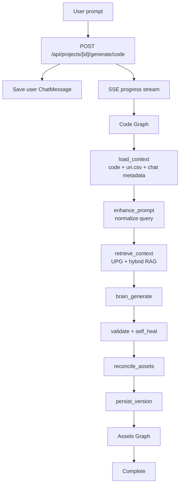
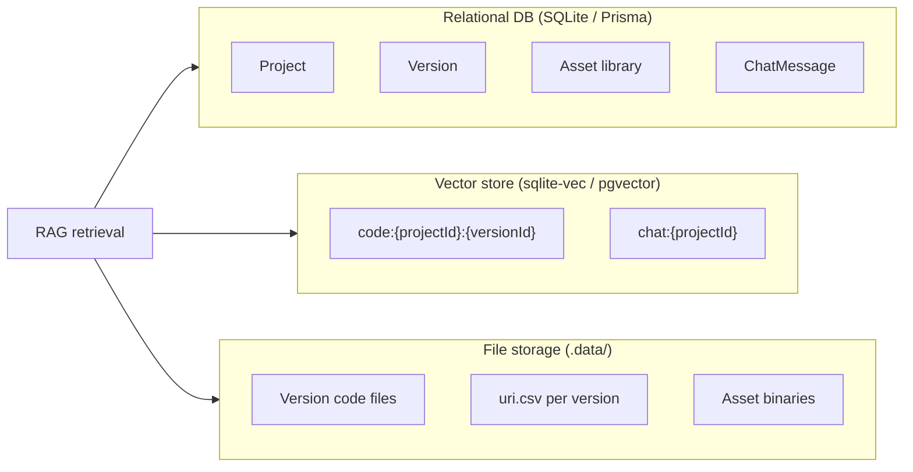
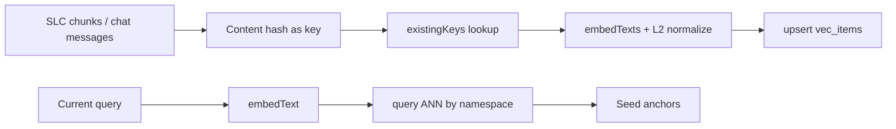
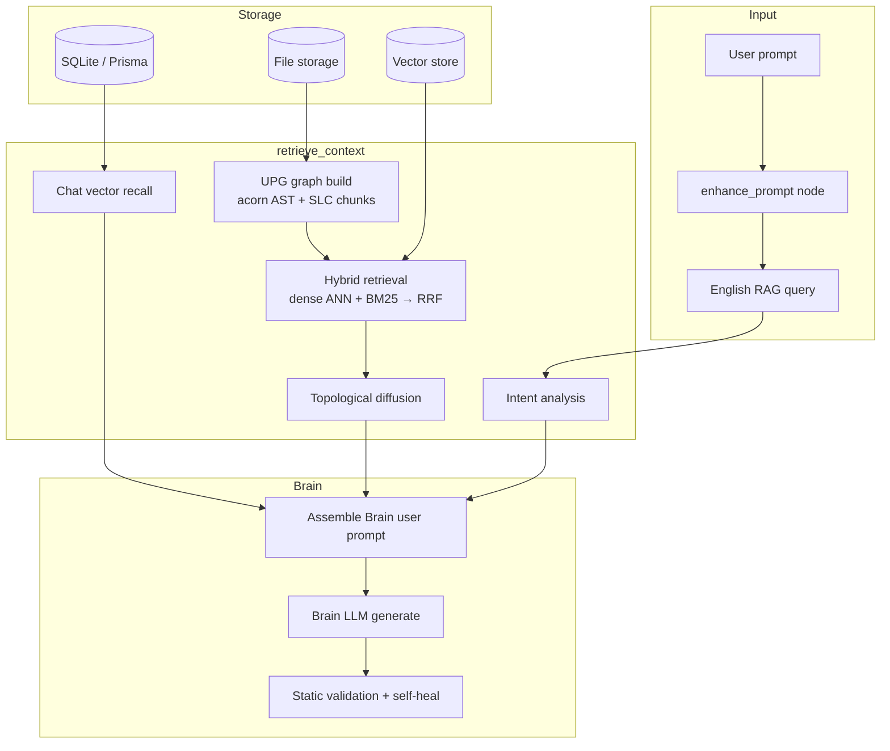
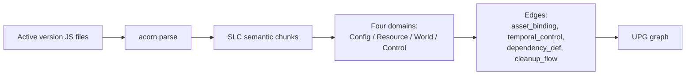
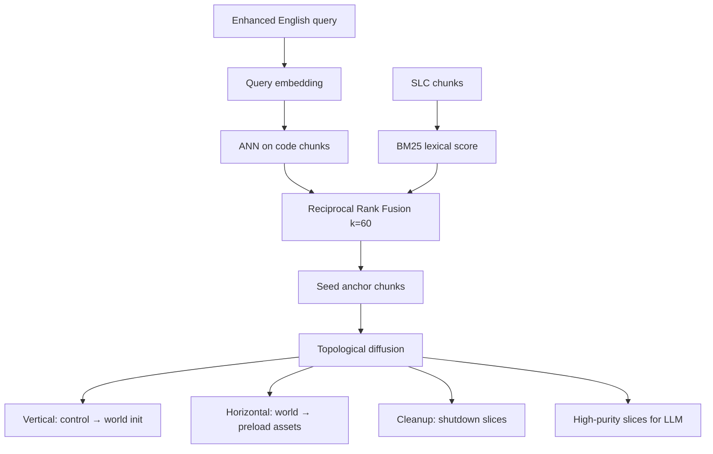
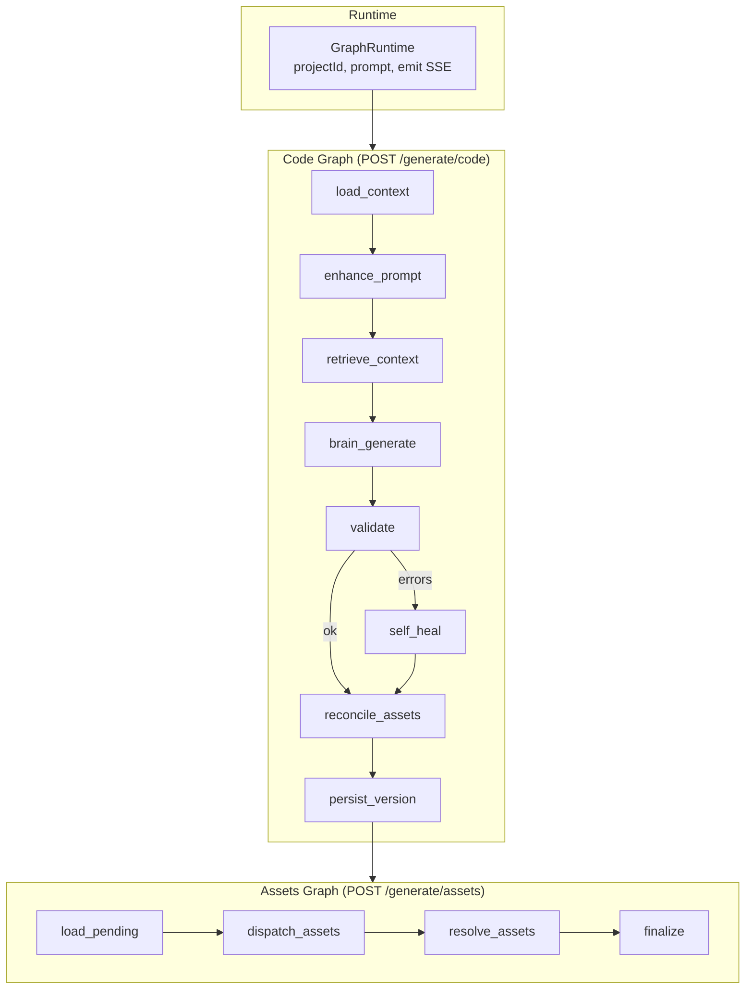

# OminiStudio Feature Release — 2026-06-26

Major release: **UPG + AST RAG**, **LangGraph orchestration**, **pre-RAG prompt enhancement**, **change manifests**, and **live Code Editor streaming**.

---

## 1. Context-Aware Iteration

| Capability | Implementation |
|------------|----------------|
| Project context on every prompt | `load_context` loads active version code, `uri.csv`, and file tree |
| Intent-based retrieval (Cursor-style) | `analyzePromptIntent` in `brain-context-retrieval.ts` |
| Long chat (50–100+ turns) | Tiered chat: recent window + relevance picks + compressed timeline (`brain-chat-history.ts`) |

---

## 2. Brain Session UI & Version Management

| Feature | Location |
|---------|----------|
| Input / output token estimates | `brain_context_start`, `brain_token_usage` SSE → `BrainContextFeed` |
| Live RAG context lines (ephemeral) | `brain_context_line` → `BrainSessionDisplay.contextLines` |
| Version delete | `DELETE /api/projects/[id]/versions` + `VersionPanel` |
| Preview resize fix | `GamePreview` — iframe resizes without distorting the game canvas |
| Phaser game quality skill | `skills/phaser-h5-game/SKILL.md` injected into Brain system prompt |
| Real-time file tree during generation | `generationLive` + `CodeEditorPanel` live sync |

---

## 3. RAG Architecture (Deep Dive)

OminiStudio uses **Unified Phaser Graph (UPG) + AST RAG** instead of naive keyword retrieval. Static analysis (acorn) builds a Phaser-specific graph; a two-stage pipeline (hybrid coarse retrieval → topological diffusion) produces high-purity, low-token context.

### 3.1 End-to-end prompt flow

### 3.2 Three storage layers

| Layer | Role |
|-------|------|
| **Relational DB** | Projects, versions, shared asset library, chat history |
| **Vector store** | ANN over code SLC chunks and chat messages; namespaces per version/chat |
| **File storage** | Immutable version code trees, per-version `uri.csv`, asset binaries |

**Vector indexing flow:**

### 3.3 RAG core pipeline

### 3.4 UPG graph construction

- **Config** — `new Phaser.Game(config)`, physics, canvas, scene list
- **Resource** — `preload` / `this.load.*` asset keys
- **World** — entities created in `create` (sprites, groups, text)
- **Control** — lifecycle hooks, input, collisions, timers

SLC chunks anchor on Phaser factory calls, absorb related config/state, and bind metadata (scene, lifecycle, asset keys, line range).

### 3.5 Hybrid retrieval + topological diffusion

**Phase 1 — Hybrid coarse retrieval** (`hybrid-retrieval.ts`):
- Dense: embed each SLC chunk → ANN search in version namespace
- Lexical: BM25 (k1=1.4, b=0.75)
- Fuse with RRF; top-K become seed anchors

**Phase 2 — Topological diffusion** (`topo-diffusion.ts`):
- Walk UPG edges from seeds to recover dependencies
- Always inject config node (physics/canvas/scene table)
- Prune unrelated branches; enforce char/chunk budget

**Chat recall** (`brain-chat-vector.ts`): ANN over `chat:{projectId}` for messages outside the recent window.

**Retrieval policy:**
- Brain LLM receives **current request only** — no full chat dump in the generation prompt
- No full codebase injection — retrieved slices + entry files only
- Compact `uri.csv` inventory (no generation prompts) in Brain prompt; Brain outputs asset **delta**
- Phaser graph summary shown in RAG feed UI, not in the LLM prompt

### 3.6 Fallback matrix

| Condition | Behavior |
|-----------|----------|
| No embedding configured | Dense retrieval off → TF-IDF cosine + BM25 |
| Local embedding model unavailable | Lexical fallback |
| Vector store init fails | Full lexical fallback |
| Brain LLM not configured | Mock demo platformer |
| Brain first attempt fails | Compact budget retry |
| File fails acorn parse | Raw file injected as fallback |
| Self-heal does not reduce errors | Keep original output |

**Key modules:** `src/lib/engine/upg/`, `brain-context-retrieval.ts`, `brain-context.ts`, `src/lib/vector/`, `embedding.ts`

---

## 4. LangGraph Pipeline

Generation is split into two **StateGraph** pipelines (`@langchain/langgraph`) with SSE progress per node. Implementation: `src/lib/engine/graph/`.

### 4.1 Architecture

- **State channels:** `Annotation.Root({...})` — nodes return partial state updates
- **Runtime:** `GraphRuntime` passed via `config.configurable.runtime` (keeps SSE `emit` out of serializable state)
- **Node wrapper:** `defineNode()` emits `node_started` / `node_completed`; nodes emit fine-grained events

### 4.2 Code Graph nodes

| Node | Responsibility | Key outputs / events |
|------|----------------|----------------------|
| `load_context` | Load project, active version code, `uri.csv`, file paths | `brainContext`, `existingUriRows`, `status`, `thinking` |
| `enhance_prompt` | Pre-RAG prompt normalization with file tree + compact assets + recent chat | `enhancedPrompt`, `ragQueryPrompt`, `prompt_enhance_start`, `prompt_enhanced`, `llm_thinking_chunk` |
| `retrieve_context` | UPG build, hybrid RAG, chat recall, prompt assembly | `prepared`, `brain_context_start`, `brain_context_line` |
| `brain_generate` | Brain LLM call with streaming | `brainResult`, `file_content_progress`, `llm_code_output_start` |
| `validate` | acorn + Phaser static checks | `issues`, `errorCount` |
| `self_heal` | One corrective Brain pass on validation errors | Updated `files` if errors reduced |
| `reconcile_assets` | Merge asset delta, compute change manifest | `change_manifest`, `brain_decision`, `files_planned` |
| `persist_version` | Create version, write files, pending assets | `version_created`, `file_written`, `code_complete` |

**Routing:** `validate` → `self_heal` (if errors and Brain configured) → `reconcile_assets` → `persist_version`

### 4.3 Assets Graph nodes

| Node | Responsibility | Key events |
|------|----------------|------------|
| `load_pending` | Read `pending-assets.json` for the version | `assets_planned` |
| `dispatch_assets` | Reuse (`regenerate: false`) or Expert Image LLM generate | `asset_generating`, `asset_reused`, `asset_generated` |
| `resolve_assets` | Replace `asset://` in code with real URLs, write `uri.csv` | `file_content_progress`, `file_written` |
| `finalize` | Create assistant chat message, emit complete | `change_manifest`, `complete` |

### 4.4 SSE → UI mapping

| Event | UI destination |
|-------|----------------|
| `node_started` / `node_completed` | Chat **Graph pipeline** checklist |
| `brain_context_line` | **BrainContextFeed** (RAG detail, scrollable) |
| `prompt_enhanced` | Progress line + enhanced prompt popover |
| `llm_thinking_chunk` | Chat thinking panel |
| `file_content_progress` | **Code Editor** live content (not chat) |
| `change_manifest` | **ChangeManifestPanel** (files/assets delta) |

---

## 5. Context & Output Optimizations

| Change | Detail |
|--------|--------|
| Compressed chat for enhancer | Last 8 turns + change records in `enhance_prompt` only |
| Compact `uri.csv` in Brain prompt | No generation prompts in inventory; Brain outputs asset **delta** |
| Partial file merge | `mergeBrainFilesWithExisting` — Brain returns changed files only |
| Brain LLM streaming | SSE `file_content_progress` → Code Editor live updates |
| Cancel / retry | `AbortController` in `page.tsx`; Retry button in `ChatPanel` |

---

## 6. Change Manifest & Asset Fixes

| Fix | Detail |
|-----|--------|
| Empty Assets after iteration | `findAssetsReferencedInCode()` detects baked `/api/data/` URLs |
| Chat change summaries | `ChangeManifestPanel` — file/asset added, modified, deleted, reused |
| Empty prompts on reused assets | `resolveReusePrompt()` + dispatch fallback + GET assets enrichment |

---

## 7. Prompt Enhancement & Chat UX

### enhance_prompt node

- **Greenfield:** comprehensive Phaser game spec from directory + compact assets + recent chat
- **Iteration:** precise delta prompt using change records from assistant message `files` JSON
- Output: `{ displayPrompt, ragPrompt }` in English; non-English user input translated for RAG retrieval

### Chat UI

| Feature | SSE / UI |
|---------|----------|
| Enhanced prompt summary + popover | `prompt_enhanced` → link with full text, copy, draggable header, scroll |
| LLM thinking stream | `llm_thinking_chunk` (enhance + brain phases) |
| Code stream in Code Editor (not chat) | `file_content_progress` during `brain_generate` |
| Thinking cleared on code output | `llm_code_output_start` |

---

## 8. English-Only Codebase

- All UI strings and LLM display instructions are English
- `isNonEnglishPrompt()` routes non-English user input through English RAG queries
- No non-English literals under `src/`

---

## 9. Key Source Files

| Area | Paths |
|------|-------|
| LangGraph | `src/lib/engine/graph/code-graph.ts`, `assets-graph.ts`, `runtime.ts`, `io.ts` |
| RAG / UPG | `src/lib/engine/upg/`, `brain-context-retrieval.ts`, `brain-context.ts` |
| Vectors | `src/lib/vector/`, `src/lib/engine/embedding.ts`, `local-embedding.ts` |
| Prompt enhance | `src/lib/engine/prompt-enhancer.ts` |
| Brain LLM | `src/lib/engine/brain-llm.ts`, `llm-providers/brain-provider.ts` |
| Change UI | `src/lib/change-manifest.ts`, `src/components/ChatPanel.tsx` |
| Live editor | `src/lib/generation-live.ts`, `src/components/CodeEditorPanel.tsx` |
| Pipeline entry | `src/lib/engine/pipeline.ts`, `src/app/api/projects/[id]/generate/code/route.ts` |
